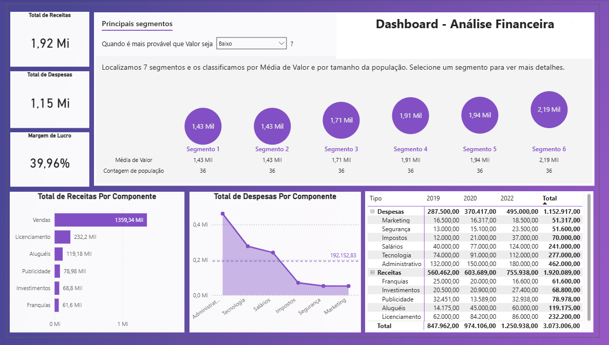

# Dashboard Financeiro – Power BI 💰📊  

## 📌 Sobre o projeto  
Este projeto foi desenvolvido no **Power BI** a partir de uma base de dados financeira (`DadosFinanceiros.xlsx`).  
O objetivo foi criar um **dashboard analítico** para monitorar receitas, despesas e margem de lucro, além de detalhar informações por componentes e anos.  

## 🔎 Perguntas respondidas  
1. Qual o **total de receitas**?  
2. Qual o **total de despesas**?  
3. Qual a **margem de lucro**?  
4. Qual o **total de receitas por componente**?  
5. Qual o **total de despesas por componente em relação à média de despesas**?  
6. Qual o **total de receitas e despesas por componente e por ano**, considerando a hierarquia **Tipo/Componente**?  

## ⚙️ Funcionalidades do Dashboard  
- KPIs de **Receita, Despesa e Margem de Lucro**  
- Análises detalhadas por **componente e hierarquia**  
- Comparação de despesas em relação à **média geral**  
- Evolução de receitas e despesas **ao longo dos anos**  

## 🛠️ Ferramentas utilizadas  
- **Power BI** (modelagem, DAX e visualizações interativas)  
- **Excel (XLSX)** como fonte de dados  

## 📂 Estrutura do repositório  
- `DashFin.pbix` → Dashboard principal no Power BI  
- `DadosFinanceiros.xlsx` → Fonte de dados utilizada  

## 📸 Preview do Dashboard   
  

## 🚀 Resultados  
O projeto possibilitou:  
- Monitorar indicadores financeiros de forma clara  
- Comparar despesas de cada componente em relação à média  
- Explorar hierarquia **Tipo/Componente** para detalhar análises  
- Visualizar tendências financeiras ao longo do tempo  

---
